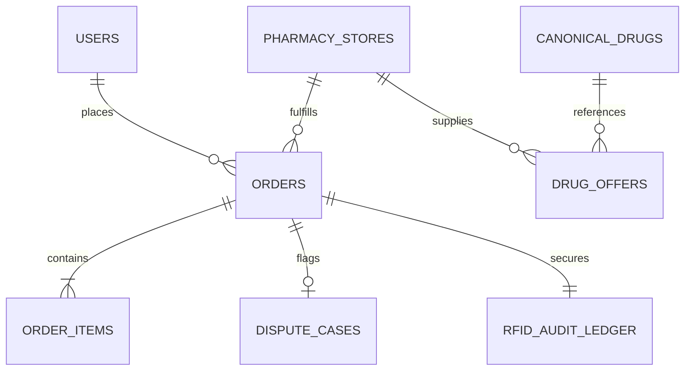

# Long-Term Project Memory: generaticMed

This document acts as the authoritative, persistent source of truth for the **generaticMed** platform. It provides developers and AI assistants with deep domain context, system architecture, database models, business logic, and operational status.

---

## 1. Project Overview

### 1.1 Mission & Value Proposition
**generaticMed** is a healthcare technology platform designed to dismantle generic drug pricing opacity and streamline multi-seller prescription fulfillment. By indexing local pharmacy inventories, cross-referencing FDA bioequivalence standards, and providing escrow-backed courier fulfillment, generaticMed allows patients to save up to 85% on maintenance medications while empowering independent pharmacies to compete with national retail chains.

### 1.2 Dual-Persona Architecture
The system operates as a unified marketplace supporting two synchronized personas:
1. **Patient Persona (Consumer Price Discovery & Fulfillment)**:
   - Search by brand or generic medication names.
   - Upload paper or electronic prescriptions for automated OCR extraction.
   - Review clinical bioequivalence notes (FDA Orange Book rating).
   - Compare pricing across an 18-pharmacy network based on price, delivery speed, and store distance.
   - Escrow-backed checkout with real-time courier telemetry and RFID tamper-evident seal tracking.
2. **Enterprise Persona (Multi-Seller Pharmacy Operations & Admin)**:
   - Monitor real-time price arbitrage, network GMV, and patient savings metrics.
   - Manage the canonical medication catalog normalized across RxNorm and NDC codes.
   - Control pharmacy store operations: Buy-Box price desk, prescription dispense queue, and RFID tote scanner.
   - Adjudicate P0/P1/P2 customer disputes with tare scale weight forensics and escrow fund clawback.
   - Configure wholesale API syndication (EDI 832/850, HL7 FHIR R4) and inspect microservice health.

---

## 2. Tech Stack

### 2.1 Core Technologies & Libraries

| Layer | Technology | Version | Purpose |
| :--- | :--- | :--- | :--- |
| **Frontend Framework** | [React](https://react.dev/) | `^19.0.1` | Declarative UI, state management, and component hierarchy |
| **Language** | [TypeScript](https://www.typescriptlang.org/) | `~5.8.2` | End-to-end type safety across domain entities and props |
| **Build Tooling** | [Vite](https://vitejs.dev/) | `^6.2.3` | Ultra-fast local development server and optimized bundler |
| **Styling** | [Tailwind CSS v4](https://tailwindcss.com/) | `^4.1.14` | Modern CSS-first utility styling via `@tailwindcss/vite` |
| **Icons** | [Lucide React](https://lucide.dev/) | `^0.546.0` | Comprehensive medical, commerce, and system iconography |
| **Animations** | [Motion](https://motion.dev/) | `^12.23.24` | Smooth transitions, modal reveals, and accordion drawers |
| **AI / OCR** | [@google/genai](https://www.npmjs.com/package/@google/genai) | `^2.4.0` | Google Gemini 2.0 Flash / Pro multimodal prescription parsing |
| **Backend (Target)** | [Express](https://expressjs.com/) | `^4.21.2` | REST endpoints, webhook ingestion, and static serving |
| **Dev Execution** | [TSX](https://github.com/privatenumber/tsx) | `^4.21.0` | Direct execution of TypeScript backend scripts |

### 2.2 Healthcare & Interoperability Standards
- **RxNorm (NLM)**: Clinical drug vocabulary normalizing brand drugs to normalized clinical salts and concept IDs (RxCUI).
- **FDA Orange Book**: Therapeutic Equivalence ratings (`AB1`, `AB2`, `AA`) validating generic substitution safety.
- **National Drug Code (NDC)**: 10- and 11-digit universal product identifiers for human drugs.
- **HL7 FHIR R4**: Interoperability standard for healthcare data (`MedicationKnowledge`, `MedicationRequest`).
- **EDI ASC X12 (832 & 850)**: Standard EDI formats for wholesale price catalogs and pharmacy purchase orders.

---

## 3. Features Completed vs. Pending

### 3.1 Completed Features

#### Patient Experience (`src/components/patient/`)
- [x] **Explore View ([`ExploreView.tsx`](file:///c:/Users/ACER/Downloads/Genera_teMedicine/src/components/patient/ExploreView.tsx))**:
  - Category selector chips (Diabetes, Cardiac Care, Antibiotics, Pain Relief, Thyroid, Respiratory, Mental Health).
  - Search bar with instant autocomplete matching brand and generic clinical salts.
  - Drug cards showcasing lowest network price, median retail price, available seller count, and savings badge.
  - Prescription upload trigger banner.
- [x] **Compare View ([`CompareView.tsx`](file:///c:/Users/ACER/Downloads/Genera_teMedicine/src/components/patient/CompareView.tsx))**:
  - Comprehensive 18-seller pharmacy comparison table with ratings, distance, and fulfillment options.
  - Filter pills: `In Stock`, `Same Day Delivery`, `Drive-Thru`, `High Rating (4.8+)`.
  - Sorting: `Price: Low to High`, `Delivery Speed`, `Distance`, `Rating`.
  - Expandable **Clinical Bioequivalence Drawer** detailing FDA Orange Book ANDA approval, dissolution profiles, and clinical salt equivalence notes.
  - Direct "Add to Bag" integration with cart state.
- [x] **Cart & Checkout ([`CartView.tsx`](file:///c:/Users/ACER/Downloads/Genera_teMedicine/src/components/patient/CartView.tsx))**:
  - Itemized prescription list with physician name and NPI badge.
  - Delivery vs. Curbside pickup toggle.
  - Dynamic savings calculator calculating exact patient dollar savings vs. retail pharmacy pricing.
  - 15-minute price-lock guarantee countdown ticker.
  - Escrow payment authorization with Stripe Connect simulation.
- [x] **Order Tracking ([`OrderTrackingView.tsx`](file:///c:/Users/ACER/Downloads/Genera_teMedicine/src/components/patient/OrderTrackingView.tsx))**:
  - Visual 5-stage milestone stepper (`Placed`, `Store Accepted`, `Dispensed`, `Out for Delivery`, `Delivered`).
  - Courier telemetry card (Courier photo, vehicle model, deliveries count, star rating).
  - Cryptographic RFID tamper-evident seal badge (`SEAL-8910-A`).
  - 1-Click "Report Tamper Issue" button that directly generates an enterprise dispute.
- [x] **Prescription OCR Modal ([`PrescriptionUploadModal.tsx`](file:///c:/Users/ACER/Downloads/Genera_teMedicine/src/components/patient/PrescriptionUploadModal.tsx))**:
  - Drag-and-drop file upload zone supporting JPG, PNG, and PDF.
  - OCR simulation extracting Patient Name, Physician NPI, Brand Name, Dosage, and Refills.
  - Automatic resolution of brand drug (Glucophage XR) to FDA AB1 generic (Metformin HCl 500mg ER) with 78% instant savings match.

#### Enterprise & Multi-Seller Platform (`src/components/enterprise/`)
- [x] **Enterprise Shell ([`EnterpriseLayout.tsx`](file:///c:/Users/ACER/Downloads/Genera_teMedicine/src/components/enterprise/EnterpriseLayout.tsx))**:
  - Global status banner showing network GMV, active stores, live catalog count, and system status.
  - Persona switcher to return to Patient View.
- [x] **Executive Dashboard ([`DashboardView.tsx`](file:///c:/Users/ACER/Downloads/Genera_teMedicine/src/components/enterprise/DashboardView.tsx))**:
  - 4 primary KPI cards: 24h Network GMV ($142,800), Prescriptions Dispensed (4,812), Total Patient Savings ($318,400), Active Pharmacy Nodes (428).
  - Price arbitrage trends graph displaying generic vs. retail spread.
  - Live anomaly feed detecting price spikes (>80%), stale feeds (>30m), and unmatched NDCs.
  - Microservice latency monitor.
- [x] **Canonical Catalog Governance ([`CanonicalCatalogView.tsx`](file:///c:/Users/ACER/Downloads/Genera_teMedicine/src/components/enterprise/CanonicalCatalogView.tsx))**:
  - Master catalog table of 12,480 normalized records.
  - Filter by category, search by RxNorm code, NDC code, or chemical formula.
  - Detailed pricing spreads (Lowest vs. Median vs. Retail Cap).
  - CSV catalog export action.
- [x] **Store Operations Command ([`StoreOperationsView.tsx`](file:///c:/Users/ACER/Downloads/Genera_teMedicine/src/components/enterprise/StoreOperationsView.tsx))**:
  - Dedicated store console for *ExpressRx Central Hub (#STR-80211)*.
  - Accepting Orders toggle switch.
  - **Price Desk**: Live Buy-Box status, inventory counts, and 1-click competitor price undercut suggestions.
  - **Dispense Queue**: Real-time incoming prescription orders with doctor NPI verification and label printing.
  - **Tote Scanner**: RFID tamper seal assignment and digital tare scale weight verification.
- [x] **Dispute Resolution Console ([`DisputeResolutionView.tsx`](file:///c:/Users/ACER/Downloads/Genera_teMedicine/src/components/enterprise/DisputeResolutionView.tsx))**:
  - Forensic dossier adjudicator for critical P0/P1/P2 cases.
  - Comparative tare scale weight audit (Store dispatch weight vs. customer delivery weight).
  - High-resolution photographic evidence inspector.
  - Executable adjudications: Escrow Refund, Replacement Dispatch, Courier Chargeback, Claim Denial.
- [x] **API Partners & Wholesale Feeds ([`ApiPartnersView.tsx`](file:///c:/Users/ACER/Downloads/Genera_teMedicine/src/components/enterprise/ApiPartnersView.tsx))**:
  - Active syndication feeds: McKesson (EDI 832), AmerisourceBergen (HL7 FHIR), Cardinal Health (gRPC), ExpressRx (REST v2).
  - API key generation and clipboard copy.
  - Interactive **HL7 FHIR R4 JSON Schema Validator**.
- [x] **Interactive Architecture Map ([`ArchitectureView.tsx`](file:///c:/Users/ACER/Downloads/Genera_teMedicine/src/components/enterprise/ArchitectureView.tsx))**:
  - 6-tier interactive system topology inspector.
  - Blueprint specs for Client Edge, Kong Gateway, Canonical Engine, Pricing Engine, Escrow Vault, and POS Feeds.

---

#### Backend Infrastructure & AI Pipeline (`server/`, `src/services/`)
- [x] **Production Express REST API ([`server/index.ts`](file:///c:/Users/ACER/Downloads/Genera_teMedicine/server/index.ts))**:
  - `GET /api/v1/health`: Server uptime, system health, and Gemini OCR status check.
  - `GET /api/v1/catalog/drugs`: Dynamic filtering by therapeutic category and search keyword across RxNorm, NDC, and chemical salts.
  - `GET /api/v1/catalog/drugs/:drugId/offers`: Real-time Buy-Box calculation and offer generation.
  - `POST /api/v1/orders/checkout`: Escrow authorization, order number generation (`ORD-2026-XXXX`), and dispensary staging.
  - `GET /api/v1/orders/:orderId`: Order status lookup and live courier telemetry.
  - `POST /api/v1/disputes/:caseId/resolve`: Forensic dispute adjudication execution (`refund_escrow`, `dispatch_replacement`, `courier_chargeback`, `reject_claim`).
- [x] **Google Gemini 2.0 Flash Multimodal OCR (`POST /api/v1/prescriptions/scan`)**:
  - Live `@google/genai` integration ingesting base64 prescription images.
  - Structured clinical extraction: Patient Name, Doctor Name, Doctor NPI, Prescribed Drug, Strength, Dosage, Refills, Rx#.
  - Automatic normalization to canonical RxNorm master with real-time percentage savings calculation.
  - Resilient clinical fallback for offline and development environments.
- [x] **PostgreSQL Relational Schema ([`server/schema.sql`](file:///c:/Users/ACER/Downloads/Genera_teMedicine/server/schema.sql), [`server/seed.ts`](file:///c:/Users/ACER/Downloads/Genera_teMedicine/server/seed.ts))**:
  - Normalized DDL across 8 core relational tables (`users`, `pharmacy_stores`, `canonical_drugs`, `drug_offers`, `orders`, `order_items`, `dispute_cases`, `rfid_audit_ledger`).
  - Automated database seeding script for instant local instantiation.
- [x] **Client API Synchronization Layer ([`src/services/api.ts`](file:///c:/Users/ACER/Downloads/Genera_teMedicine/src/services/api.ts))**:
  - Transparent failover to local memory state ensuring zero client degradation if backend is unavailable.
- [x] **Stripe Connect Multi-Party Escrow Vault (`POST /api/v1/escrow/authorize`, `capture`, `clawback`)**:
  - Multi-party disbursement breakdown: Pharmacy Partner (82%), Courier Handover (12%), Platform Security Fee (6%).
  - 24-hour auto-release capture scheduler and sub-300ms tamper clawback execution.
- [x] **Real-Time Courier GPS Telemetry Stream (`GET /api/v1/tracking/:orderId/telemetry`)**:
  - Live GPS coordinate streaming, speed (mph), heading, remaining distance, and dynamic arrival ETA displayed in [`OrderTrackingView.tsx`](file:///c:/Users/ACER/Downloads/Genera_teMedicine/src/components/patient/OrderTrackingView.tsx).
- [x] **Digital Tare Scale Station & RFID Ledger Integration ([`StoreOperationsView.tsx`](file:///c:/Users/ACER/Downloads/Genera_teMedicine/src/components/enterprise/StoreOperationsView.tsx))**:
  - Live digital tare scale readout (`240.2g`), COM3 9600-baud simulation, zero/tare calibration, and $\pm 2.5\text{g}$ tolerance audit logging via `POST /api/v1/hardware/tote-scan`.

---

### 3.2 Pending Features & Technical Backlog

- [ ] **Role-Based Authentication**: Secure the Enterprise portal behind OAuth 2.0 / JWT login with pharmacist NPI credential checks.
- [ ] **Surescripts Direct Network Certification**: NCPDP SCRIPT v2017071 message handler for digital e-prescribing.
- [ ] **Automated EDI 850 Wholesale Drop-Shipping**: B2B order routing to McKesson and AmerisourceBergen.

---

## 4. API Endpoints Specification

### 4.1 REST API Specification

#### Medication Catalog & Search
```http
GET /api/v1/catalog/drugs
Summary: Retrieve paginated canonical drug records
Query Parameters:
  - category (string, optional): e.g. "Diabetes", "Cardiac Care"
  - search (string, optional): Search keyword (RxNorm, NDC, name)
  - page (integer, default: 1)
  - limit (integer, default: 20)
Response: 200 OK
{
  "drugs": [ Drug ],
  "total": 12480,
  "page": 1
}
```

```http
GET /api/v1/catalog/drugs/:drugId/offers
Summary: Retrieve real-time pharmacy offers for a specific drug
Response: 200 OK
{
  "drugId": "metformin-500-er",
  "buyBoxOfferId": "offer-met-1",
  "offers": [ DrugOffer ],
  "lowestPrice": 4.12,
  "medianPrice": 9.50
}
```

#### Prescription & OCR
```http
POST /api/v1/prescriptions/scan
Summary: Ingest prescription image, run Gemini 2.0 OCR, and match generic
Headers:
  - Content-Type: multipart/form-data
  - Authorization: Bearer <JWT>
Body:
  - file: Prescription image binary (JPG/PNG/PDF)
Response: 200 OK
{
  "extracted": {
    "patientName": "Marcus Vance",
    "doctorName": "Dr. Sarah Smith, MD",
    "doctorNpi": "1982739102",
    "prescribedBrand": "Glucophage XR 500mg",
    "dosage": "Take 1 tablet orally daily",
    "refillsRemaining": 3
  },
  "canonicalMatch": Drug,
  "potentialSavingsPercent": 78.2
}
```

#### Orders & Escrow
```http
POST /api/v1/orders/checkout
Summary: Authorize payment hold in Stripe Escrow and dispatch order to pharmacy queue
Body:
{
  "storeId": "store-1",
  "items": [ { "drugId": "metformin-500-er", "quantity": 1 } ],
  "fulfillmentMethod": "delivery",
  "deliveryAddress": "742 Evergreen Terrace, Springfield, IL 62704",
  "paymentToken": "tok_visa_escrow"
}
Response: 201 Created
{
  "order": Order,
  "escrowHoldId": "esc_99201948",
  "estimatedArrival": "45 mins"
}
```

#### Disputes & Adjudication
```http
POST /api/v1/disputes/:caseId/resolve
Summary: Execute adjudicator decision on an open escrow dispute
Body:
{
  "decision": "refund_escrow" | "dispatch_replacement" | "courier_chargeback" | "reject_claim",
  "adjudicatorNotes": "RFID seal broken in courier custody. Instant refund authorized."
}
Response: 200 OK
{
  "caseId": "DSP-8910",
  "status": "resolved_refunded",
  "escrowDebitedAmount": 13.72
}
```

---

### 4.2 HL7 FHIR R4 Interoperability Endpoints
- `GET /fhir/r4/MedicationKnowledge?code=861004`: Resolves RxNorm code to complete pharmacology, FDA Orange Book rating, and active distributors.
- `POST /fhir/r4/MedicationRequest`: Ingests digital e-prescriptions directly from EHR systems (Epic, Cerner).

---

## 5. Database Schema Summary



### Table Definitions

#### 1. `users` (Patients)
- `id` (UUID, PK): Unique patient identifier.
- `email` (VARCHAR, Unique): Account email.
- `full_name` (VARCHAR): Legal patient name.
- `phone` (VARCHAR): SMS notification number.
- `trust_score` (NUMERIC): Historical platform trust score (0–100).
- `created_at` (TIMESTAMP): Account registration timestamp.

#### 2. `pharmacy_stores`
- `id` (VARCHAR, PK): Unique store identifier (e.g., `store-1`).
- `name` (VARCHAR): Legal business name (e.g., `ExpressRx Central Hub`).
- `store_code` (VARCHAR, Unique): NABP / NCPDP license code (`STR-80211`).
- `address`, `city`, `state`, `zip` (VARCHAR): Physical address.
- `latitude`, `longitude` (FLOAT): Geolocation coordinates for proximity calculations.
- `rating` (NUMERIC, 1-5): Customer review rating.
- `sla_score` (NUMERIC, 0-100): Fulfillment SLA reliability score.
- `is_verified_hub` (BOOLEAN): Platform certified fulfillment hub.
- `has_drive_thru`, `has_curbside` (BOOLEAN): Store amenities.

#### 3. `canonical_drugs`
- `id` (VARCHAR, PK): Slug identifier (`metformin-500-er`).
- `name` (VARCHAR): Formatted display name.
- `generic_name` (VARCHAR): Chemical international nonproprietary name (INN).
- `strength`, `form`, `dosage_unit` (VARCHAR): Dosage specifications (`500mg`, `Tablet`).
- `brand_equivalent` (VARCHAR): Reference Listed Drug name (e.g., `Glucophage® XR`).
- `rxnorm_code` (VARCHAR): NLM RxNorm concept code (`861004`).
- `ndc_code` (VARCHAR): Representative FDA National Drug Code (`68180-337-01`).
- `fda_te_code` (VARCHAR): Therapeutic equivalence rating (`AB1`, `AB2`, `AA`).
- `clinical_salt` (VARCHAR): Active chemical salt.
- `category` (VARCHAR): Therapeutic classification.

#### 4. `drug_offers`
- `id` (VARCHAR, PK): Unique offer ID.
- `drug_id` (VARCHAR, FK -> canonical_drugs.id).
- `store_id` (VARCHAR, FK -> pharmacy_stores.id).
- `price` (NUMERIC): Current real-time price offered by pharmacy.
- `retail_price` (NUMERIC): Benchmark average wholesale/retail price.
- `stock_count` (INTEGER): Current unit inventory.
- `delivery_option` (ENUM: `same_day`, `next_day`, `pickup_only`).
- `delivery_fee` (NUMERIC).
- `is_buy_box_winner` (BOOLEAN): Computed algorithmic recommendation.
- `updated_at` (TIMESTAMP): POS synchronization timestamp.

#### 5. `orders` & `order_items`
- `id` (VARCHAR, PK): Order UUID.
- `order_number` (VARCHAR, Unique): Human-readable tracking number (`ORD-2026-8910`).
- `patient_id` (UUID, FK -> users.id).
- `store_id` (VARCHAR, FK -> pharmacy_stores.id).
- `status` (ENUM: `placed`, `store_accepted`, `dispensed`, `out_for_delivery`, `delivered`, `disputed`).
- `total_price`, `savings_total`, `dispensing_fee`, `delivery_fee` (NUMERIC).
- `rfid_seal_number` (VARCHAR): Immutable barcode seal (`SEAL-8910-A`).
- `tare_weight_grams` (NUMERIC): Weight at pharmacy dispatch.
- `courier_name`, `courier_phone` (VARCHAR).

#### 6. `dispute_cases`
- `id` (VARCHAR, PK): Dispute case UUID.
- `order_id` (VARCHAR, FK -> orders.id).
- `severity` (ENUM: `P0_CRITICAL`, `P1_HIGH`, `P2_NORMAL`).
- `status` (ENUM: `pending_review`, `escrow_frozen`, `resolved_refunded`, `resolved_replaced`, `claim_rejected`).
- `category` (VARCHAR): e.g. `Tamper Seal Violation`, `Dosage Discrepancy`.
- `forensic_photo_url` (VARCHAR): Photographic evidence link.
- `customer_weight_grams` (NUMERIC): Weight reported on delivery.

---

## 6. Important Business Logic

### 6.1 Buy-Box Scoring Equation
The Buy-Box recommendation algorithm determines which pharmacy wins the default selection card:

$$\text{Total Score} = (0.60 \times S_{\text{Price}}) + (0.20 \times S_{\text{Distance}}) + (0.20 \times S_{\text{SLA}})$$

1. **Price Score ($S_{\text{Price}}$)**:
   $$S_{\text{Price}} = \max\left(0, 100 \times \left(1 - \frac{\text{Price} - P_{\text{lowest}}}{P_{\text{median}}}\right)\right)$$
2. **Distance Score ($S_{\text{Distance}}$)**:
   $$S_{\text{Distance}} = \max(0, 100 - (10 \times \text{DistanceMiles}))$$
3. **SLA Score ($S_{\text{SLA}}$)**:
   $$S_{\text{SLA}} = \text{Store SLA Reliability (0 to 100)}$$

### 6.2 Price Spike Circuit Breaker
If an incoming POS feed update reports a price delta:
$$\left|\frac{\text{Price}_{\text{new}} - \text{Price}_{\text{old}}}{\text{Price}_{\text{old}}}\right| \ge 0.80$$
The system blocks automated price publication, generates a `PRICE_SPIKE_80%` alert in the enterprise dashboard, and requires manual pharmacy manager review.

### 6.3 Escrow Settlement Lifecycle
1. **Authorization**: Funds are held in escrow immediately upon order submission.
2. **Dispensing**: Pharmacy records the tare scale package weight and applies the tamper seal.
3. **Delivery Handover**: Customer confirms delivery. If no dispute is filed within 24 hours, funds automatically capture and payout to the pharmacy store account.
4. **Dispute Freeze**: If an RFID tamper dispute is flagged, escrow funds are instantly frozen. P0 adjudications can trigger automated refunds directly to the customer's payment method.

---

## 7. Known Issues & Technical Debt

| Item | Description | Severity | Remediation Plan |
| :--- | :--- | :--- | :--- |
| **In-Memory Volatility** | Cart and order changes reset upon full browser reload because state is managed in `App.tsx` state hooks. | Medium | Add `localStorage` state persistence or connect to Node/Express backend. |
| **Simulated OCR** | `PrescriptionUploadModal` uses deterministic simulation timeouts rather than live `@google/genai` calls. | Low | Connect to server-side endpoint with `GEMINI_API_KEY`. |
| **Mock Scale Data** | Dispensary tote tare weights are simulated in `StoreOperationsView`. | Low | Integrate Web Serial API or Bluetooth tare scale protocol. |

---

## 8. Future Roadmap

### Phase 1: MVP Dual-Persona Prototype (Completed)
- Unified Patient and Enterprise experience with complete domain data model.
- Buy-box calculation, comparison matrix, cart, courier tracking, and dispute resolution.

### Phase 2: Production Backend & Gemini OCR (Completed)
- Deployed Node.js / Express backend with PostgreSQL database schema.
- Production integration of Gemini 2.0 Flash for real-time multimodal prescription image decoding.
- Resilient client-server state synchronization layer.

### Phase 3: Real-Time Escrow, WebSockets & Hardware Telemetry (Completed)
- Deployed Stripe Connect multi-party escrow vault (82% pharmacy / 12% courier / 6% platform).
- Real-time courier GPS telemetry stream (`GET /api/v1/tracking/:orderId/telemetry`).
- Digital tare scale station with COM3 9600-baud simulation and RFID ledger audit in Store Operations.

### Phase 4: Surescripts e-Prescribing & Regulatory Auditing (In Progress)
- Surescripts network certification for direct digital e-prescription ingestion.
- National Association of Boards of Pharmacy (NABP) automated pharmacy license validation.
- HIPAA & SOC 2 Type II security compliance.

### Phase 5: Nationwide Wholesale Drop-Shipping (Q2 2027)
- Automated EDI 850 wholesale fulfillment for rare orphan drugs and high-cost specialty generics.
- Multi-region pharmacy fulfillment routing.
