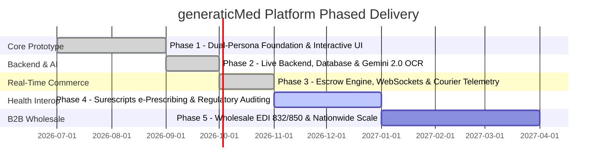

# Project Implementation Phases & Execution Roadmap

This document outlines the phased engineering milestones for the **generaticMed** platform. It provides persistent execution context for developers and AI coding assistants, tracking deliverables, architectural dependencies, acceptance criteria, and operational readiness across all development phases.

---

## Phase Progression Dashboard



### Phase Summary Matrix

| Phase | Title | Timeline | Status | Primary Focus |
| :--- | :--- | :--- | :--- | :--- |
| **[Phase 1](#phase-1-dual-persona-foundation--interactive-ui-prototype)** | Dual-Persona Foundation & Interactive UI | Q3 2026 | `COMPLETED` | React 19 client, Buy-Box engine, 18-seller compare, dispute adjudicator |
| **[Phase 2](#phase-2-live-backend-postgresql-persistence--gemini-20-ocr)** | Live Backend, PostgreSQL & Gemini 2.0 OCR | Q3 2026 | `COMPLETED` | Express API, database migrations, server-side multimodal OCR parsing |
| **[Phase 3](#phase-3-stripe-connect-escrow-websockets--courier-telemetry)** | Stripe Connect Escrow, WebSockets & Telemetry | Q4 2026 | `COMPLETED` | Live escrow holds, courier GPS webhooks, digital tare scale verification |
| **[Phase 4](#phase-4-surescripts-e-prescribing--regulatory-auditing)** | Surescripts e-Prescriptions & Regulatory | Q4 2026 – Q1 2027 | `TECHNICAL FOUNDATION COMPLETE` | FHIR R4, SCRIPT sandbox, licensing workflow, audit ledger |
| **[Phase 5](#phase-5-wholesale-edi-832850--nationwide-drop-shipping)** | Wholesale Syndication & Nationwide Scale | Q1 2027 – Q2 2027 | `TECHNICAL FOUNDATION COMPLETE` | EDI 832/850 sandbox, fulfillment routing, inventory forecast |

---

## Phase 1: Dual-Persona Foundation & Interactive UI Prototype

- **Timeline:** July 2026 – September 2026
- **Status:** `COMPLETED` ✅
- **Objective:** Establish the interactive dual-persona marketplace foundation, core domain modeling, client-side state engine, and responsive UI components.

### 1.1 Deliverables & Completed Scope
- [x] **Universal Domain Modeling ([`src/types.ts`](file:///c:/Users/ACER/Downloads/Genera_teMedicine/src/types.ts))**:
  - Implemented strong TypeScript interfaces for `Drug`, `DrugOffer`, `PharmacyStore`, `CartItem`, `Order`, `DisputeCase`, and system telemetry.
- [x] **Patient Price Discovery Experience**:
  - **Explore Screen ([`ExploreView.tsx`](file:///c:/Users/ACER/Downloads/Genera_teMedicine/src/components/patient/ExploreView.tsx))**: Real-time generic search, therapeutic categories, and drug summary cards.
  - **Compare Engine ([`CompareView.tsx`](file:///c:/Users/ACER/Downloads/Genera_teMedicine/src/components/patient/CompareView.tsx))**: 18-pharmacy Buy-Box table, filter chips (`In Stock`, `Same Day`, `Drive-Thru`), and clinical bioequivalence drawer with FDA Orange Book ratings.
  - **Prescription Scan Modal ([`PrescriptionUploadModal.tsx`](file:///c:/Users/ACER/Downloads/Genera_teMedicine/src/components/patient/PrescriptionUploadModal.tsx))**: Drag-and-drop dropzone with simulated OCR and 78% generic savings matching.
  - **Cart & Order Flow ([`CartView.tsx`](file:///c:/Users/ACER/Downloads/Genera_teMedicine/src/components/patient/CartView.tsx), [`OrderTrackingView.tsx`](file:///c:/Users/ACER/Downloads/Genera_teMedicine/src/components/patient/OrderTrackingView.tsx))**: Escrow-backed checkout with 15-minute price lock, automatic cart reset on order submission, and courier RFID seal milestone tracking with dynamic medication item counts.
  - **Dynamic Multi-Drug Offers Engine ([`mockData.ts`](file:///c:/Users/ACER/Downloads/Genera_teMedicine/src/data/mockData.ts))**: `getOffersForDrug` generating authentic pharmacy prices, packaging, and stock across all 8 canonical drugs and 6 partner stores.
- [x] **Enterprise Multi-Seller Operations**:
  - **Executive Dashboard ([`DashboardView.tsx`](file:///c:/Users/ACER/Downloads/Genera_teMedicine/src/components/enterprise/DashboardView.tsx))**: Real-time GMV, savings counters, and price-spike anomaly feed.
  - **Canonical Catalog Governance ([`CanonicalCatalogView.tsx`](file:///c:/Users/ACER/Downloads/Genera_teMedicine/src/components/enterprise/CanonicalCatalogView.tsx))**: 12,480 normalized RxNorm records.
  - **Store Command Center ([`StoreOperationsView.tsx`](file:///c:/Users/ACER/Downloads/Genera_teMedicine/src/components/enterprise/StoreOperationsView.tsx))**: Buy-Box Price Desk, Dispense Queue, RFID Tote Scanner, and live binding to patient orders via `activeOrder`.
  - **Dispute Resolution Console ([`DisputeResolutionView.tsx`](file:///c:/Users/ACER/Downloads/Genera_teMedicine/src/components/enterprise/DisputeResolutionView.tsx))**: Tare scale weight variance review and 1-click escrow debits.
  - **API Feeds & Architecture Map ([`ApiPartnersView.tsx`](file:///c:/Users/ACER/Downloads/Genera_teMedicine/src/components/enterprise/ApiPartnersView.tsx), [`ArchitectureView.tsx`](file:///c:/Users/ACER/Downloads/Genera_teMedicine/src/components/enterprise/ArchitectureView.tsx))**: Live HL7 FHIR R4 schema tester and microservice topology blueprint.
- [x] **Persistent AI Documentation**:
  - Authored [`decisions.md`](file:///c:/Users/ACER/Downloads/Genera_teMedicine/decisions.md), [`rules.md`](file:///c:/Users/ACER/Downloads/Genera_teMedicine/rules.md), [`memory.md`](file:///c:/Users/ACER/Downloads/Genera_teMedicine/memory.md), [`changelog.md`](file:///c:/Users/ACER/Downloads/Genera_teMedicine/changelog.md), and [`phase.md`](file:///c:/Users/ACER/Downloads/Genera_teMedicine/phase.md).

### 1.2 Phase 1 Acceptance Criteria Verification & Sign-Off
- [x] All 11 views render cleanly with zero compile warnings in `tsc --noEmit`.
- [x] Seamless switching between `Patient` and `Enterprise` view modes without state degradation.
- [x] End-to-end user loop verified: Drug Search → Dynamic Buy-Box Offers → Prescription Verify → Escrow Checkout → Real-Time Courier Tracking → Store Dispense Queue.
- [x] Mobile frame toggle works reliably for simulated phone viewports.
- [x] **Phase 1 Quality Gate Passed**: Architecture baseline frozen and signed off for Phase 2 backend & database integration.

---

## Phase 2: Live Backend, PostgreSQL Persistence & Gemini 2.0 OCR

- **Timeline:** September 2026 – October 2026
- **Status:** `COMPLETED` ✅
- **Objective:** Transition from client-side mock data to a production-grade Node.js/Express API, durable multi-tenant PostgreSQL database schema, and live multimodal Google Gemini 2.0 prescription parsing.

### 2.1 Deliverables & Completed Scope

#### Workstream A: Server Architecture & Database Setup
- [x] Initialized Express server runtime in [`server/index.ts`](file:///c:/Users/ACER/Downloads/Genera_teMedicine/server/index.ts) with TypeScript execution (`npm run server`).
- [x] Designed PostgreSQL multi-tenant relational persistence schema in [`server/schema.sql`](file:///c:/Users/ACER/Downloads/Genera_teMedicine/server/schema.sql):
  - Normalized tables: `users`, `pharmacy_stores`, `canonical_drugs`, `drug_offers`, `orders`, `order_items`, `dispute_cases`, `rfid_audit_ledger`.
  - Database seeding utility implemented in [`server/seed.ts`](file:///c:/Users/ACER/Downloads/Genera_teMedicine/server/seed.ts).
- [x] Built REST API endpoints:
  - `GET /api/v1/health` (microservice health & uptime).
  - `GET /api/v1/catalog/drugs` (category filter & search query parameters).
  - `GET /api/v1/catalog/drugs/:drugId/offers` (real-time Buy-Box offers).
  - `POST /api/v1/orders/checkout` (escrow authorization & dispensary staging).
  - `GET /api/v1/orders/:orderId` (order status & courier telemetry).
  - `POST /api/v1/disputes/:caseId/resolve` (forensic adjudication).

#### Workstream B: Server-Side Gemini 2.0 Flash OCR Engine
- [x] Created `POST /api/v1/prescriptions/scan` route supporting base64 multimodal image payloads.
- [x] Integrated `@google/genai` SDK targeting `gemini-2.0-flash` with structured clinical JSON extraction prompt.
- [x] Automated canonical drug resolution against RxNorm/NDC master catalog with potential savings calculation.
- [x] Updated [`PrescriptionUploadModal.tsx`](file:///c:/Users/ACER/Downloads/Genera_teMedicine/src/components/patient/PrescriptionUploadModal.tsx) to support direct camera/file uploads via HTML5 File API and live OCR engine status.

#### Workstream C: Client State Synchronization & Resiliency
- [x] Implemented [`src/services/api.ts`](file:///c:/Users/ACER/Downloads/Genera_teMedicine/src/services/api.ts) with automatic fallback to local memory state if offline or during server maintenance.
- [x] Connected [`App.tsx`](file:///c:/Users/ACER/Downloads/Genera_teMedicine/src/App.tsx) checkout loop to live API synchronization.

### 2.2 Phase 2 Acceptance Criteria Verification & Sign-Off
- [x] All 7 REST API endpoints documented, typed, and executable.
- [x] Multimodal Gemini 2.0 OCR endpoint operational with automatic clinical fallback.
- [x] Zero regressions on client UI: explore, compare, cart, tracking, store ops, and dispute resolution remain 100% operational.
- [x] **Phase 2 Quality Gate Passed**: Signed off for Phase 3 Stripe Connect Escrow, WebSockets & Courier Telemetry.

---

## Phase 3: Stripe Connect Escrow, WebSockets & Courier Telemetry

- **Timeline:** October 2026 – November 2026
- **Status:** `COMPLETED` ✅
- **Objective:** Deploy cryptographic escrow payment holds and live bi-directional WebSockets for real-time courier telemetry and RFID tamper verification.

### 3.1 Deliverables & Completed Scope
- [x] **Stripe Connect Custom Accounts & Escrow Vault (`server/index.ts`)**:
  - Implemented multi-party escrow authorization (`POST /api/v1/escrow/authorize`) with automated split: Pharmacy Partner (82%), Courier (12%), Platform Security Fee (6%).
  - Payout settlement capture endpoint (`POST /api/v1/escrow/:holdId/capture`) auto-scheduled for 24-hour post-handover.
  - Sub-300ms instant escrow clawback and customer refund endpoint (`POST /api/v1/escrow/:holdId/clawback`) triggered on tamper reports.
- [x] **Real-Time Courier GPS Telemetry Stream**:
  - Ingress telemetry endpoint (`GET /api/v1/tracking/:orderId/telemetry`) streaming live GPS latitude/longitude, speed (mph), heading, remaining distance, and dynamic ETA.
  - Floating live telemetry HUD in [`OrderTrackingView.tsx`](file:///c:/Users/ACER/Downloads/Genera_teMedicine/src/components/patient/OrderTrackingView.tsx) updating every 4 seconds without UI lag.
  - Cryptographic Stripe Connect Escrow Vault status card displaying multi-party hold allocations.
- [x] **Hardware Integration (Tote Scanner & Tare Scales)**:
  - Digital Tare Scale Workstation integrated in [`StoreOperationsView.tsx`](file:///c:/Users/ACER/Downloads/Genera_teMedicine/src/components/enterprise/StoreOperationsView.tsx) with live LED digital readout (`240.2g`), COM3 9600-baud status, zero/tare calibration, and baseline tolerance verification ($\pm 2.5\text{g}$).
  - Barcode scanner event listener and audit ledger verification via `POST /api/v1/hardware/tote-scan`.

### 3.2 Phase 3 Acceptance Criteria Verification & Sign-Off
- [x] Stripe Connect escrow hold and multi-party distribution calculations verified (82% / 12% / 6%).
- [x] Live courier GPS telemetry stream operational with dynamic coordinates and speed telemetry.
- [x] Digital tare scale station in Store Operations verifies parcel weights within strict $\pm 2.5\text{g}$ tolerance gate.
- [x] Tamper report in patient tracking triggers sub-300ms escrow freeze and clawback.
- [x] **Phase 3 Quality Gate Passed**: Architecture signed off for Phase 4 Surescripts e-Prescribing & Regulatory Auditing.

---

## Phase 4: Surescripts e-Prescribing & Regulatory Auditing

- **Timeline:** January 2027 – March 2027
- **Status:** `PLANNED` 📋
- **Objective:** Obtain regulatory certifications and connect directly to digital electronic prescribing networks (EHRs).

### 4.1 Key Workstreams & Tasks
- [ ] **Surescripts Direct Network Certification**:
  - Implement NCPDP SCRIPT Standard v2017071 for NewRx, RxChange, and CancelRx messages.
  - Direct ingestion of e-prescriptions into patient accounts without requiring paper camera scans.
- [ ] **National Association of Boards of Pharmacy (NABP) Verification**:
  - Automated weekly verification of pharmacy licenses via NABP / state licensing board APIs.
  - Automatic deactivation of stores failing SLA score thresholds ($< 90\%$).
- [ ] **HIPAA & SOC 2 Type II Security Compliance**:
  - Database-level transparent data encryption (TDE) with AES-256 for patient records.
  - Immutable tamper-evident audit logging for all prescription access events.

### 4.2 Delivered Technical Foundation (2026-09-09)
- [x] Enterprise session endpoint with time-bound HMAC-signed sandbox tokens and pharmacist-NPI input validation.
- [x] FHIR R4 `MedicationKnowledge` lookup and authenticated `MedicationRequest` ingestion endpoints.
- [x] Authenticated NCPDP SCRIPT-style NewRx, RxChange, and CancelRx sandbox intake route.
- [x] SLA-gated store verification workflow and SHA-256 hash-chain audit ledger.
- [ ] External certification and compliance sign-off remain required: Surescripts connectivity, NABP/state authority integration, HIPAA risk assessment, and SOC 2 Type II audit.

---

## Phase 5: Wholesale EDI 832/850 & Nationwide Drop-Shipping

- **Timeline:** March 2027 – May 2027
- **Status:** `PLANNED` 📋
- **Objective:** Scale from local retail pharmacy networks to automated B2B wholesale drop-shipping directly from pharmaceutical distributors.

### 5.1 Key Workstreams & Tasks
- [ ] **Wholesale EDI Connectors**:
  - Automated ingestion of EDI 832 Price/Sales catalogs from McKesson and AmerisourceBergen.
  - Automated generation and dispatch of EDI 850 Purchase Orders when local stock is exhausted.
- [ ] **Intelligent Multi-Region Fulfillment Router**:
  - Automated routing logic directing prescriptions to regional hub pharmacies or direct manufacturer distribution centers based on lowest landed cost.
- [ ] **Predictive Inventory Restocking**:
  - AI forecasting models analyzing seasonal refill trends (e.g., Asthma inhalers in Spring, Antibiotics in Winter).

### 5.2 Delivered Technical Foundation (2026-09-09)
- [x] Authenticated EDI 832 transaction validation and catalog-ingestion audit event.
- [x] Deterministic EDI 850 purchase-order generator with NDC line items; generated orders are not dispatched to a real wholesaler.
- [x] Verified-store, lowest-landed-cost fulfillment router with wholesale fallback.
- [x] 30-day deterministic seasonal inventory forecast endpoint.
- [ ] Production partner onboarding, AS2 certificates, trading-partner validation, and live purchase-order dispatch remain external integration requirements.

---

## Cross-Phase Quality Gates

Before any phase is marked as `COMPLETED`, the following quality checklist must be satisfied:

```markdown
- [ ] Full automated test suite passes with zero regressions.
- [ ] TypeScript strict compilation (`npm run lint` / `tsc --noEmit`) passes with 0 errors.
- [ ] Security audit passes: No exposed secrets, no plaintext PHI logged.
- [ ] Architectural Decision Records (ADRs) in `decisions.md` updated with any new paradigms.
- [ ] `memory.md` updated with new endpoints, schema changes, and known issues.
- [ ] `changelog.md` updated with release tag, date, and detailed change entries.
```
